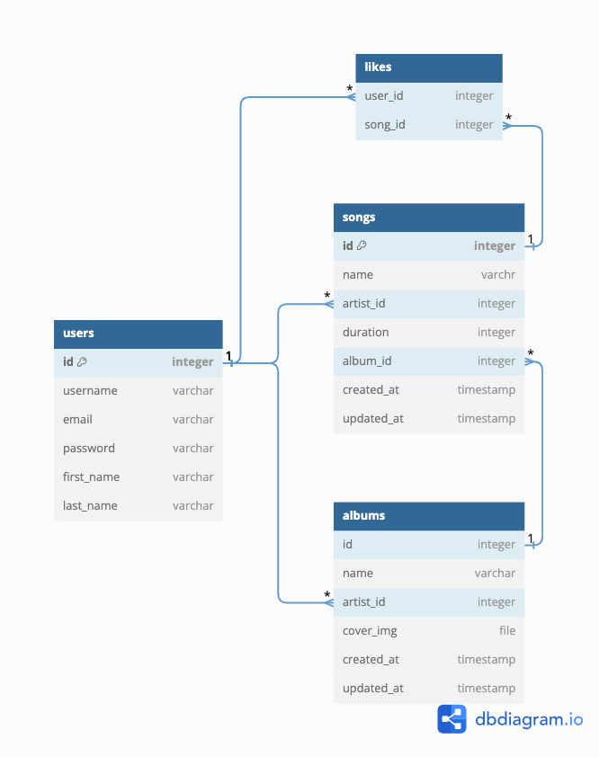

# Rhythm Realm

RhythmRealm, a Spotify clone, is a website for users to discover, upload, and organize songs, albums, and playlists.

https://rhythmrealm.onrender.com/

# Feature List

## 1. Songs
* Users should be able to view all Songs.
* Users should be able to upload songs.
* Users should be able to update their uploaded songs.
* Users should be able to delete their uploaded songs.

## 2. Albums
* Users should be able to view all albums created by users.
* Users should be able to create albums.
* Users should be able to update an album (add or remove songs) they created.
* Users should be able to delete their albums.

## 3. Likes
* Users should be able to view the likes on a song.
* Users should be able to like a song.
* Users should be able to unlike a song.

## 4. Play Songs
* User should be able to play a song.

## 5. Search
* Users should be able to search for songs by artist or song name.
* Users should be able to view the results of their search.

## 6.1 Bonus Feature: Playlists
* Users should be able to view all of their playlists.
* Users should be able to add a song to one of their playlists.
* Users should be able to remove a song from a playlist.

## 6.2 Bonus Feature: WaveForms
* Users should be able to see the wave forms for a song.

# **Database Schema**

## `users`

| column name | data type | details                   |
|-------------|-----------|---------------------------|
| id          | integer   | not null, primary key     |
| username    | varchar   | not null, unique          |
| email       | varchar   | not null, unique          |
| password    | varchar   | not null                  |
| first_name  | varchar   | not null                  |
| last_name   | varchar   | not null                  |

## `songs`

| column name | data type | details               |
|-------------|-----------|-----------------------|
| id          | integer   | not null, primary key |
| name        | varchar   | not null              |
| artist_id   | integer   | not null, foreign key |
| album_id    | integer   | not null, foreign key |
| duration    | integer   | not null              |
| created-at  | datetime  | not null              |
| updated-at  | datetime  | not null              |

* `artist_id` references `users` table
* `album_id` references `albums` table

## `albums`

| column name | data type | details               |
|-------------|-----------|-----------------------|
| id          | integer   | not null, primary key |
| name        | varchar   | not null              |
| artist_id   | integer   | not null, foreign key |
| cover_img   | file      | not null              |
| created-at  | datetime  | not null              |
| updated-at  | datetime  | not null              |

* `artist_id` references `users` table

## `likes`

| column name | data type | details               |
|-------------|-----------|-----------------------|
| id          | integer   | not null, primary key |
| user_id     | integer   | not null, foreign key |
| song_id     | integer   | not null, foreign key |

* `user_id` references `users` table
* `song_id` references `songs` table

<!-- ## `playlists`

| column name | data type | details               |
|-------------|-----------|-----------------------|
| id          | integer   | not null, primary key |
| playlist_name| varchar  | not null              |
| creator_id  | integer   | not null, foreign key |
| song_id     | integer   | not null, foreign key |
| created-at  | datetime  | not null              |
| updated-at  | datetime  | not null              |

* `creator_id` references `users` table
* `song_id` references `songs` table -->

# User Stories

## Users

### Sign Up

* As an unregistered and unauthorized user, I want to be able to sign up for the website via a sign-up form.
  * When I'm on the `/signup` page:
    * I would like to be able to enter my email, username, and preferred password on a clearly laid out form.
    * I would like the website to log me in upon successful completion of the sign-up form.
      * So that I can seamlessly access the site's functionality
  * When I enter invalid data on the sign-up form:
    * I would like the website to inform me of the validations I failed to pass, and repopulate the form with my valid entries (except my password).
    * So that I can try again without needing to refill forms I entered valid data into.

### Log in

* As a registered and unauthorized user, I want to be able to log in to the website via a log-in form.
  * When I'm on the `/login` page:
    * I would like to be able to enter my email and password on a clearly laid out form.
    * I would like the website to log me in upon successful completion of the lob-up form.
      * So that I can seamlessly access the site's functionality
  * When I enter invalid data on the log-up form:
    * I would like the website to inform me of the validations I failed to pass, and repopulate the form with my valid entries (except my password).
      * So that I can try again without needing to refill forms I entered valid data into.

### Demo User

* As an unregistered and unauthorized user, I would like an easy to find and clear button on both the `/signup` and `/login` pages to allow me to visit the site as a guest without signing up or logging in.
  * When I'm on either the `/signup` or `/login` pages:
    * I can click on a Demo User button to log me in and allow me access as a normal user.
      * So that I can test the site's features and functionality without needing to stop and enter credentials.

### Log Out

* As a logged in user, I want to log out via an easy to find log out button on the navigation bar.
  * While on any page of the site:
    * I can log out of my account and be redirected to a page displaying recent FauxTweets.
      * So that I can easily log out to keep my information secure.

### Viewing Songs

* As a logged in _or_ logged out user, I want to be able to view a selection of all the songs.
  * When I'm on the `/songs` page:
    * I can view the ten most recently created songs.
    * I can also view the duration and likes of the songs.

### Viewing Albums
* As a logged in _or_ logged out user, I want to be able to view a selection of all the albums.
  * When I'm on the `/albums` page:
    * I can view the ten most recently created albums.

* As a logged in _or_ logged out user, I want to be able to view a specific album and all the songs belong to this album.
  * When I'm on the `/albums/:id` page:
    * I can view the content of the album as well as the associated songs.
    * I can also view the duration and likes of the songs.

### Upload Songs

* As a logged in user, I want to be able to upload new songs.
  * When I'm on the `/songs/new` page:
    * I can upload a new song.

### Create Albums

* As a logged in user, I want to be able to create a new album.
  * When I'm on the `/albums/new` page:
    * I can create a new album.

### Updating Songs

* As a logged in user, I want to be able to update my songs by clicking an Update button.
  * When I'm on the `/users/current/songs` pages:
    * I can click "Update" to make changes to songs I have uploaded.

### Updating Albums
* As a logged in user, I want to be able to update my albums by clicking an Update button.
  * When I'm on the `/users/current/albums` pages:
    * I can click "Update" to make changes to albums I have created.
      * I can add or remove songs I uploaded from the albums.

### Deleting Songs

* As a logged in user, I want to be able to delete my songs by clicking a Delete button.
  * When I'm on the `/users/current/songs` pages:
    * I can click "Delete" to permanently delete a song I have uploaded.

### Deleting albums

* As a logged in user, I want to be able to delete my albums by clicking a Delete button.
  * When I'm on the `/users/current/albums` pages:
    * I can click "Delete" to permanently delete an album I have created.

### Viewing Likes

* As a logged in _or_ logged out user, I want to be able to view all the likes of the songs.
  * When I'm on the `/songs` or `/albums/:id` page:
    * I can view total likes of the songs.

### Editing Likes

* As a logged in user, I want to be able to like or unlike a song by clicking a heart button.
  * When I'm on the `/songs` or `/albums/:id` page:
    * I can like or unlike the songs.

### Playing Songs

* As a logged in user, I want to be able to play songs by clicking a play button.
  * When I'm on the `/songs` or `/albums/:id` page:
    * I can play the songs.

### Searching Songs

* As a logged in _or_ logged out user, I want to be able to search for songs by clicking the search button on the header.
  * When I'm on any page of the site:
    * I can click the search button for songs or albums searching.

# Project Done By:
   * [Elaine Fan](https://github.com/elainefan331)
   * [Cindy Li](https://github.com/cccc9612)
   * [Hao Xu](https://github.com/haoxugt)
